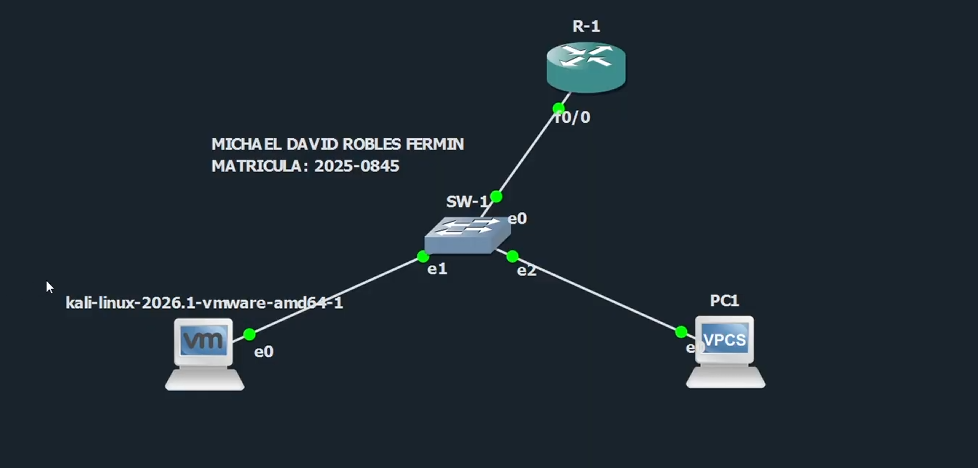
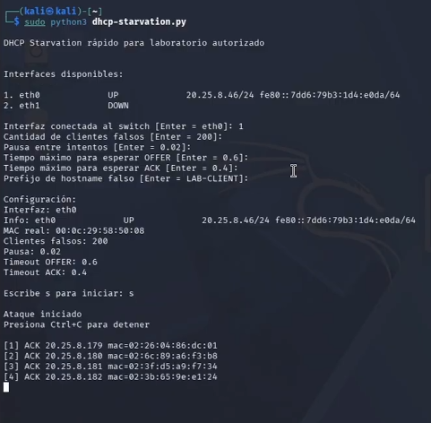
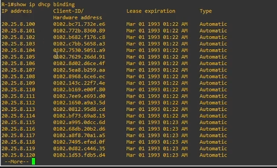
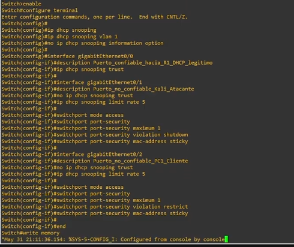
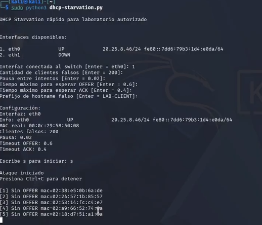
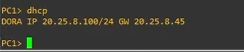

# DHCP Starvation Attack Lab


## Información del proyecto

- **Autor:** Michael David Robles Fermín
- **Matrícula:** 2025-0845
- **Docente:** Jonathan Rondón
- **Asignatura:** Seguridad de Redes
- **Repositorio:** https://github.com/iClexi/DHCP-Starvation-Attack
- **Video:** https://youtu.be/_hAUU0W4hLw?si=vcRpOVleFQxaPitr
- **Documentación técnica profesional:** [docs/documentacion-tecnica-profesional.pdf](docs/documentacion-tecnica-profesional.pdf)

URL directa de la documentación técnica profesional:

```text
docs/documentacion-tecnica-profesional.pdf
```

## Aviso de uso responsable

Este proyecto fue desarrollado únicamente con fines educativos, académicos y de laboratorio controlado. Las pruebas deben ejecutarse solamente en entornos propios o autorizados como GNS3, EVE-NG, PNETLab o laboratorios internos. No debe utilizarse en redes públicas, empresariales o de terceros sin autorización explícita.

## Objetivo del laboratorio

Demostrar un ataque **DHCP Starvation**, donde Kali Linux envía múltiples solicitudes DHCP usando direcciones MAC falsas hasta agotar el pool del servidor DHCP legítimo. Después se aplica una contramedida basada en **DHCP Snooping**, **limitación de tasa** y **Port Security** para impedir que el atacante siga consumiendo direcciones IP.

## Topología de laboratorio



La red de laboratorio utiliza el segmento `20.25.8.0/24` con R-1 como servidor DHCP legítimo, SW-1 como switch de capa 2, Kali como atacante y VPC1 como cliente legítimo.

## Ejecución del ataque

Desde Kali Linux se ejecuta el script:

```bash
sudo python3 dhcp-starvation.py
```

Durante la ejecución se selecciona la interfaz conectada al switch, la cantidad de clientes falsos y los tiempos de espera para las respuestas DHCP.



## Evidencia del impacto

Mientras el ataque está activo, en R-1 se observa que el servidor DHCP tiene múltiples asignaciones dinámicas ocupadas por clientes falsos:

```cisco
show ip dhcp binding
```



Luego, cuando VPC1 intenta solicitar una dirección por DHCP, no recibe respuesta válida porque el pool fue agotado:

```text
dhcp
show ip
```


## Contramedida aplicada

La defensa se aplica en el switch SW-1. Se habilita DHCP Snooping globalmente y en la VLAN 1. El puerto hacia el router R-1 se marca como confiable, mientras que el puerto hacia Kali queda como no confiable. Además, se agrega limitación de tasa y Port Security para impedir el uso de múltiples MAC falsas desde el mismo puerto.

```cisco
configure terminal

ip dhcp snooping
ip dhcp snooping vlan 1
no ip dhcp snooping information option

interface gigabitEthernet0/0
 description HACIA_R1_DHCP_LEGITIMO
 ip dhcp snooping trust

interface gigabitEthernet0/1
 description HACIA_KALI_ATACANTE
 no ip dhcp snooping trust
 ip dhcp snooping limit rate 5
 switchport mode access
 switchport port-security
 switchport port-security maximum 1
 switchport port-security violation shutdown
 switchport port-security mac-address sticky

end
write memory
```



## Limpieza del router después del ataque

Después de aplicar la mitigación, se limpian las asignaciones DHCP, conflictos y caché ARP en R-1:

```cisco
clear ip dhcp binding *
clear ip dhcp conflict *
clear arp-cache
```


## Verificación posterior a la mitigación

Al ejecutar el ataque nuevamente, el script ya no recibe ofertas DHCP para las MAC falsas. Esto demuestra que la contramedida está bloqueando o limitando el flujo del ataque desde el puerto no confiable.



Finalmente, VPC1 vuelve a obtener una dirección IP legítima desde R-1:

```text
dhcp
show ip
```



## Comandos de verificación recomendados

En el switch:

```cisco
show ip dhcp snooping
show ip dhcp snooping binding
show port-security interface gigabitEthernet0/1
show interfaces status
show logging
```

En el router:

```cisco
show ip dhcp binding
show ip dhcp pool
show ip dhcp conflict
```

En VPC1:

```text
dhcp
show ip
```

## Conclusión

El ataque DHCP Starvation afecta directamente la disponibilidad del servicio DHCP, porque consume el pool de direcciones IP mediante solicitudes generadas con direcciones MAC falsas. Cuando el pool queda lleno, un cliente legítimo como VPC1 no puede recibir una dirección IP y pierde la capacidad de integrarse correctamente a la red.

La mitigación aplicada reduce el riesgo de forma efectiva. **DHCP Snooping** permite diferenciar puertos confiables y no confiables, **rate limit** limita la cantidad de mensajes DHCP permitidos desde el puerto atacante, y **Port Security** impide que una sola interfaz aprenda múltiples direcciones MAC falsas. En conjunto, estas medidas evitan que Kali continúe agotando el pool y permiten que el cliente legítimo vuelva a recibir DHCP correctamente.

## Enlaces directos

```text
Enlace repositorio de GitHub: https://github.com/iClexi/DHCP-Starvation-Attack

Enlace Video de Youtube: https://youtu.be/_hAUU0W4hLw?si=vcRpOVleFQxaPitr
```
